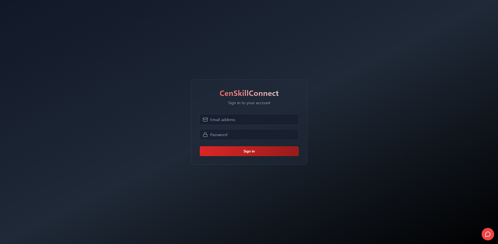
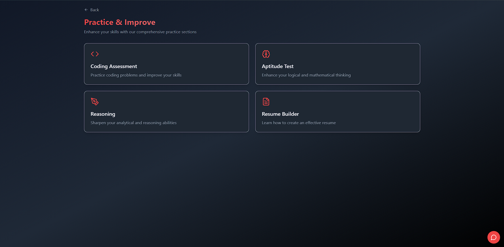
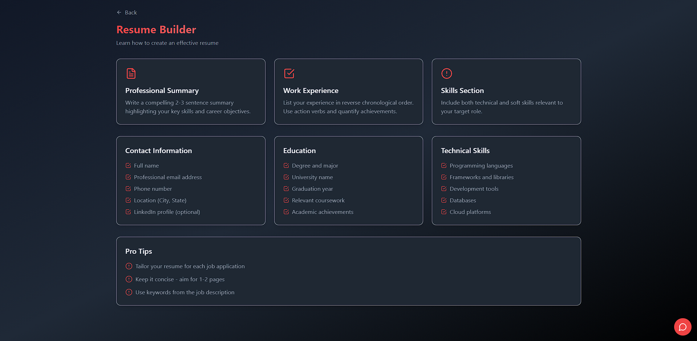
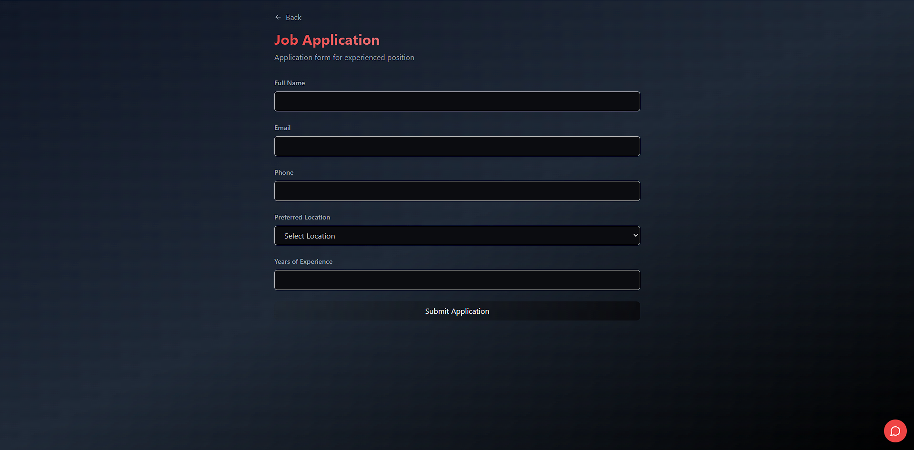
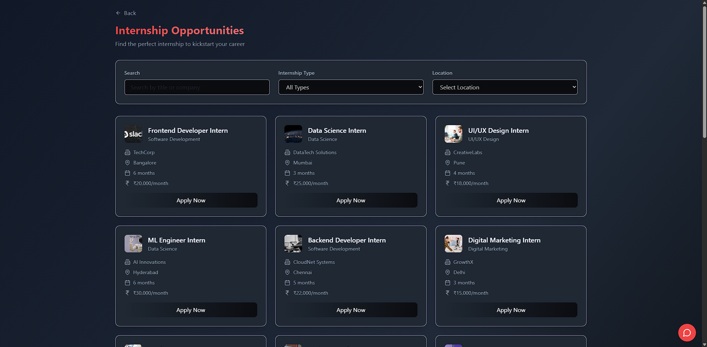
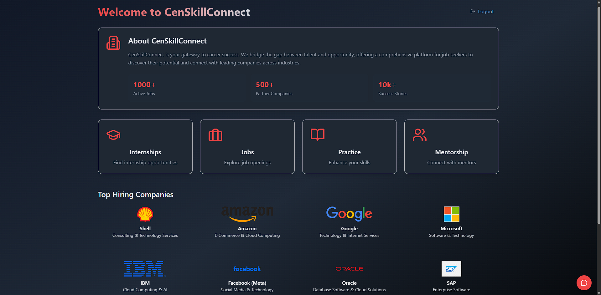
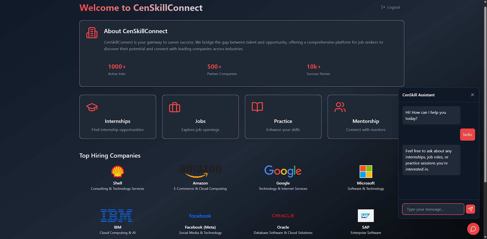

<h1 align="center">🌐 CenSkill Connect</h1>
<p align="center">
  
  
  
</p>

<p align="center">
  <em>Connecting Talent. Building Careers.</em><br>
  <strong>AI-powered job-matching platform to help job seekers and recruiters find the perfect fit.</strong>
</p>

---

## 🚀 About the Project

CenSkill Connect is an AI-driven platform that matches job seekers with relevant opportunities and helps recruiters find the best-fit candidates. With **Gemini API** for job recommendations and **Firebase** for real-time communication and authentication, it's a one-stop solution for job seekers and recruiters.

> **Project Status:** 🚧 *Currently under development! Stay tuned for exciting updates and features.*

---

## ✨ Key Features

### For Job Seekers
- 💼 **Personalized Job Recommendations**: Get job suggestions powered by AI based on your profile and preferences.
- 📝 **Interview Preparation**: Mock interviews with feedback to help you ace your job interviews.
- 💬 **In-App Messaging**: Secure communication with recruiters to stay updated about your applications.

### For Recruiters
- 📢 **Post & Manage Job Listings**: Create and manage job postings with ease.
- 👥 **View & Filter Applications**: See and filter candidates for job applications.
- 🧠 **AI-Powered Candidate Matching**: Get AI-driven suggestions for the best-fit candidates.
- 💬 **Chat with Job Seekers**: In-app messaging to engage with potential hires securely.

---

## 📱 Screenshots

<p align="center">
  
  
  
  
  
  
  
</p>


---

## ⚙️ Tech Stack

| Category        | Tools & Tech                         |
|-----------------|--------------------------------------|
| Language        | ReactJS, HTML, CSS                  |
| AI Integration  | Gemini API                          |
| Cloud Backend   | Firebase (Authentication, Firestore, Realtime DB) |
| State Management | React Context API / Redux            |
| Routing         | React Router                        |
| UI Framework    | Material-UI / Bootstrap (optional)  |
| Others          | Git, Postman                        |

---

## 🛠️ Setup Instructions

```bash
# Clone the repository
git clone https://github.com/PremSaiBollamoni/CenSkillConnect.git

# Navigate to the project folder
cd CenSkillConnect

# Install dependencies
npm install
# or
yarn install

# Set up Firebase in the project
# Download `firebase-config.js` from Firebase console and place it in the `src/` directory

# Set up Gemini API
# Get your API key from Gemini API and configure it in `src/api/gemini.js`

# Run the app
npm start
# or
yarn start
```
🤝 Contributing

1.We welcome contributions to make CenSkill Connect even better! 🎉

2.To contribute:

   -> Fork the repository.
   
   -> Create a new branch (git checkout -b feature/your-feature).
   
   -> Make your changes.
   
   -> Commit your changes (git commit -am 'Add new feature').
   
   -> Push to the branch (git push origin feature/your-feature).
   
   -> Open a pull request.

💡 Acknowledgments

-> Gemini API for job recommendations and candidate matching.

-> Firebase for real-time communication and authentication.

-> ReactJS for building interactive user interfaces.

-> Material-UI for designing responsive UI components.
